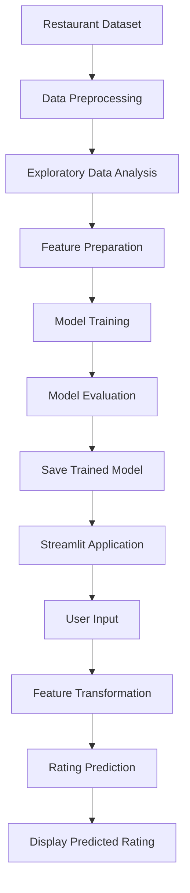

# 🍽️ Restaurant Rating Prediction

<p align="center">
  <b>Machine Learning-Based Restaurant Rating Prediction System</b>
</p>

<p align="center">
  Predict restaurant ratings using Machine Learning and an interactive Streamlit application.
</p>

<p align="center">
  
  
  
  
  
  
</p>

---

## 📋 Table of Contents

1. [Overview](#-overview)
2. [Problem Statement](#-problem-statement)
3. [Why This Project?](#-why-this-project)
4. [Features](#-features)
5. [Screenshots](#-screenshots)
6. [System Architecture](#-system-architecture)
7. [Project Workflow](#-project-workflow)
8. [Machine Learning Pipeline](#-machine-learning-pipeline)
9. [Tech Stack](#-tech-stack)
10. [Project Structure](#-project-structure)
11. [Installation](#-installation)
12. [Usage](#-usage)
13. [Model Evaluation](#-model-evaluation)
14. [Future Scope](#-future-scope)
15. [Learning Outcomes](#-learning-outcomes)
16. [Author](#-author)
17. [License](#-license)
18. [Footer](#-footer)

---

## 📌 Overview

**Restaurant Rating Prediction** is a Machine Learning project designed to predict restaurant ratings based on different restaurant-related attributes.

The project focuses on applying Machine Learning concepts to a real-world dataset and developing an interactive web application that allows users to provide restaurant information and receive a predicted rating.

This project was developed as part of my **Machine Learning Internship at Cognifyz IT Solutions Pvt. Ltd.**

The complete implementation covers:

- Data preprocessing
- Exploratory Data Analysis
- Feature preparation
- Regression-based Machine Learning
- Model training and evaluation
- Model serialization
- Interactive Streamlit application

---

## ❗ Problem Statement

Restaurant ratings play an important role in helping customers discover restaurants and make dining decisions.

However, restaurant ratings depend on multiple factors, including restaurant characteristics, location, pricing, and available services. Analysing these factors manually can be difficult when working with a large dataset.

### Problem

How can Machine Learning be used to analyse restaurant-related information and predict the expected rating of a restaurant?

### Proposed Solution

This project uses a Machine Learning regression approach to learn patterns from historical restaurant data and generate rating predictions based on user-provided input features.

The trained model is integrated into a Streamlit application for an interactive user experience.

---

## 💡 Why This Project?

This project was developed to gain practical experience in applying Machine Learning to a real-world dataset.

### Key Reasons

- Understand the complete Machine Learning development lifecycle.
- Work with real-world restaurant-related data.
- Practise data cleaning and preprocessing.
- Understand feature selection and model preparation.
- Implement regression-based prediction.
- Save and reuse trained Machine Learning models.
- Build a user-friendly ML application using Streamlit.

The project connects theoretical Machine Learning concepts with practical implementation.

---

## ✨ Features

### 📊 Data Analysis

- Restaurant dataset exploration.
- Data cleaning and preprocessing.
- Analysis of relevant restaurant attributes.
- Feature preparation for Machine Learning.

### 🤖 Machine Learning

- Regression-based rating prediction.
- Training and testing data separation.
- Model training and evaluation.
- Trained model storage using Joblib.

### 🖥️ Interactive Web Application

- Streamlit-based user interface.
- Input fields for restaurant information.
- Prediction through the trained Machine Learning model.
- Simple and interactive user experience.

### 📁 Project Organization

- Jupyter Notebook for experimentation.
- Separate application file.
- Saved Machine Learning model.
- Dataset and dependency files.
- Application output screenshots.

---

## 📸 Screenshots

### 🏠 Application Interface

The application provides an interactive interface where users can enter restaurant details such as city, average cost for two, price range, number of votes, table booking, and online delivery.


---

### 📝 Restaurant Input Form

Users can provide restaurant-related information through the input form before generating a prediction.


---

### 🎯 Prediction Result

The application displays the predicted restaurant rating along with a visual rating representation and a brief interpretation.


---

### 🧠 Factors Influencing Prediction

The application presents selected input factors, including customer engagement, location, pricing, and restaurant services.


---

### 📊 Model Performance

The application displays the trained model's evaluation metrics in the sidebar.


## 🏗️ System Architecture

The system follows a standard Machine Learning application architecture.



### Architecture Components

| Component | Description |
|---|---|
| Dataset | Provides restaurant-related information |
| Preprocessing | Cleans and prepares the dataset |
| Feature Preparation | Selects and prepares model input features |
| Model Training | Learns patterns from training data |
| Model Evaluation | Measures model performance |
| Model Storage | Saves the trained model for reuse |
| Streamlit App | Provides an interactive interface |
| Prediction Module | Generates rating predictions |

---

## 🔄 Project Workflow

The project follows the complete Machine Learning workflow:

```text
Dataset
   ↓
Data Understanding
   ↓
Data Cleaning
   ↓
Exploratory Data Analysis
   ↓
Feature Preparation
   ↓
Train-Test Split
   ↓
Model Training
   ↓
Model Evaluation
   ↓
Model Serialization
   ↓
Streamlit Integration
   ↓
Restaurant Rating Prediction
```

### Workflow Explanation

#### 1. Dataset Understanding

The restaurant dataset is loaded and analysed to understand its columns, data types, and available information.

#### 2. Data Preprocessing

The data is prepared for model training by handling relevant data quality and feature preparation requirements.

#### 3. Exploratory Data Analysis

The dataset is explored to understand patterns and relationships between restaurant attributes and ratings.

#### 4. Model Training

The prepared features are used to train a regression-based Machine Learning model.

#### 5. Model Evaluation

The trained model is evaluated using suitable regression metrics.

#### 6. Model Saving

The trained model is saved using Joblib so that it can be reused by the Streamlit application.

#### 7. Application Integration

The saved model is loaded into the Streamlit application to generate predictions from user inputs.

---

## 🧠 Machine Learning Pipeline

The Machine Learning pipeline consists of the following stages:

### 1. Data Collection

The project uses a restaurant-related dataset containing different attributes associated with restaurants.

### 2. Data Preprocessing

The dataset is examined and prepared for Machine Learning.

Typical preprocessing activities include:

- Understanding missing values.
- Checking data types.
- Preparing relevant columns.
- Handling features required by the model.

### 3. Feature Preparation

Relevant input features are prepared according to the requirements of the trained model.

The same feature structure must be maintained during application-based prediction.

### 4. Model Training

The training dataset is used to teach the regression model how restaurant-related attributes relate to restaurant ratings.

### 5. Model Evaluation

The model is tested using unseen data and suitable regression evaluation metrics.

### 6. Model Serialization

The trained model is stored in a `.pkl` file using Joblib.

This allows the application to load the model without retraining it every time.

### 7. Prediction

The Streamlit application accepts user inputs, prepares the input features, and generates a predicted restaurant rating.

---

## 🛠️ Tech Stack

### Programming Language

- **Python** – Core programming language used for development.

### Machine Learning and Data Science

- **Pandas** – Data manipulation and analysis.
- **NumPy** – Numerical operations.
- **Scikit-learn** – Machine Learning model development.
- **Joblib** – Saving and loading trained models.

### Data Analysis and Visualization

- **Matplotlib** – Data visualization.
- **Seaborn** – Statistical data visualization.
- **Jupyter Notebook** – Model experimentation and analysis.

### Application Development

- **Streamlit** – Interactive Machine Learning web application.

### Development Tools

- Visual Studio Code
- Jupyter Notebook
- Git and GitHub

---

## 📂 Project Structure

```text
Restaurant-Rating-Prediction/
│
├── app.py
├── Task1.ipynb
├── Dataset.csv
├── restaurant_rating_model.pkl
├── model_features.pkl
├── requirements.txt
├── Output_Screenshots/
│   ├── home.png
│   ├── prediction-input.png
│   ├── prediction-result.png
│   ├── influencing-factors.png
│   └── model-performance.png
└── README.md

### File Descriptions

| File/Folder | Description |
|---|---|
| `app.py` | Streamlit application for rating prediction |
| `Task1.ipynb` | Jupyter Notebook containing the ML development process |
| `Dataset.csv` | Restaurant dataset |
| `restaurant_rating_model.pkl` | Saved trained Machine Learning model |
| `model_features.pkl` | Stored model feature information |
| `requirements.txt` | Required Python dependencies |
| `Output_Screenshot's/` | Application output screenshots |
| `README.md` | Project documentation |

> Ensure that the filenames and folder names match the actual files in the repository.

---

## ⚙️ Installation

Follow the steps below to run this project on your local system.

### Prerequisites

Make sure the following software is installed:

- Python 3.x
- Git
- Visual Studio Code (recommended)
- A web browser

### Step 1: Clone the Repository

```bash
git clone https://github.com/Russel-Arjit/Restaurant-Rating-Prediction.git
```

### Step 2: Navigate to the Project Directory

```bash
cd Restaurant-Rating-Prediction
```

### Step 3: Create a Virtual Environment

```bash
python -m venv venv
```

### Step 4: Activate the Virtual Environment

For Windows:

```bash
venv\Scripts\activate
```

For macOS/Linux:

```bash
source venv/bin/activate
```

### Step 5: Install Dependencies

```bash
pip install -r requirements.txt
```

### Step 6: Verify the Project Files

Make sure the following files are available:

- `app.py`
- `restaurant_rating_model.pkl`
- `model_features.pkl` (if required by the application)
- Required dataset or supporting files

---

## 🚀 Usage

### Run the Streamlit Application

After completing the installation, execute:

```bash
streamlit run app.py
```

The Streamlit application will open in your default web browser.

If it does not open automatically, copy the local URL shown in the terminal and open it manually.

### Application Steps

1. Launch the Streamlit application.
2. Enter the required restaurant information.
3. Provide values for the available input features.
4. Submit the information through the application.
5. The trained Machine Learning model processes the input.
6. The application displays the predicted restaurant rating.

---

## 📊 Model Evaluation

The restaurant rating prediction model was developed using a **Tuned Random Forest Regression** approach.

The model performance is evaluated using R² Score, Root Mean Squared Error (RMSE), and Mean Absolute Error (MAE).

| Evaluation Metric | Result |
|---|---:|
| R² Score | 0.593 |
| RMSE | 0.355 |
| MAE | 0.256 |

### 📌 Evaluation Metrics Explained

- **R² Score:** Indicates how much variation in the target variable is explained by the model.
- **RMSE:** Measures prediction error using the square root of the average squared error.
- **MAE:** Measures the average absolute difference between actual and predicted ratings.

> These results represent the evaluation values displayed in the application. Performance may vary on different datasets.

### Evaluation Results

> Add the actual evaluation results from your notebook in the table below.

| Evaluation Metric | Result |
|---|---|
| Mean Absolute Error (MAE) | Add actual value |
| Mean Squared Error (MSE) | Add actual value |
| Root Mean Squared Error (RMSE) | Add actual value |
| R² Score | Add actual value |

**Note:** The values should be updated using the final model evaluation results from `Task1.ipynb`.

---

## 🔐 Model Storage and Reusability

The trained Machine Learning model is saved as a `.pkl` file using Joblib.

This approach provides the following benefits:

- Avoids retraining the model whenever the application starts.
- Makes the trained model reusable.
- Separates model training from application execution.
- Supports integration with a Streamlit interface.

The application loads the saved model and uses it for prediction.

---

## 🔮 Future Scope

The project can be improved further through the following enhancements:

### 1. Model Improvement

- Experiment with additional regression algorithms.
- Perform hyperparameter tuning.
- Compare multiple model performances.
- Improve feature engineering techniques.

### 2. Application Enhancements

- Add more interactive visualizations.
- Improve input validation.
- Display prediction confidence-related information where appropriate.
- Improve the overall user interface.

### 3. Deployment

- Deploy the application on a cloud platform.
- Make the application accessible through a public URL.
- Add continuous integration and deployment workflows.

### 4. Data Improvements

- Use larger and more diverse datasets.
- Include additional restaurant-related features.
- Periodically retrain the model with updated data.

---

## 🎓 Learning Outcomes

This project helped me develop practical knowledge in the following areas:

### Machine Learning

- Understanding regression-based prediction.
- Preparing data for model training.
- Splitting datasets into training and testing sets.
- Evaluating model performance.

### Python and Data Science

- Working with Pandas and NumPy.
- Performing data analysis.
- Preparing features for Machine Learning.
- Using Joblib for model serialization.

### Application Development

- Building an interactive Streamlit application.
- Integrating a trained ML model into an application.
- Handling user input for prediction.
- Organizing an ML project for deployment.

### Software Development

- Managing project files and dependencies.
- Using Git and GitHub for version control.
- Documenting a Machine Learning project.
- Understanding the connection between model development and deployment.

---

## 👨‍💻 Author

### Arjit Bhadouria

B.Tech Computer Science Engineering  
Specialization: Artificial Intelligence and Machine Learning

<p align="left">
  <a href="https://github.com/Russel-Arjit">
    
  </a>
</p>

### Areas of Interest

- Machine Learning
- Artificial Intelligence
- Natural Language Processing
- Computer Vision
- Generative AI
- Python and C++

---

## 📜 License

This project is licensed under the **MIT License**.

The MIT License permits others to use, modify, and distribute the project according to its license terms.

See the `LICENSE` file for more information.

---

## 🌟 Acknowledgement

This project was developed as part of my **Machine Learning Internship at Cognifyz IT Solutions Pvt. Ltd.**

I gained practical exposure to Machine Learning workflows, data preprocessing, model development, and application integration through this project.

---

## 🔗 Project Repository

GitHub Repository:

[Restaurant Rating Prediction](https://github.com/Russel-Arjit/Restaurant-Rating-Prediction)

---

## ⭐ Support

If you find this project useful, consider giving the repository a ⭐ star.

Thank you for visiting this project! 🚀

---

<p align="center">
  <b>Built with Python, Machine Learning, and Streamlit ❤️</b>
</p>
